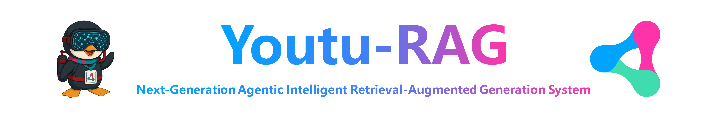

<div align="center">
  
</div>

<div align="center">

[]()
[](LICENSE)
[](https://youtu-rag-docs.vercel.app/docs/en)
[]()

English | [简体中文](README_ZH.md) 

</div>

<p align="center">
  <a href="#key-features">✨ Key Features</a> •
  <a href="#usage-examples">📖 Usage Examples</a> •
  <a href="#quick-start">🚀 Quick Start</a> •
  <a href="#benchmarks">📊 Benchmarks</a>
</p>

---

`Youtu-RAG` is a next-generation agentic retrieval-augmented generation system built on the **"Local Deployment · Autonomous Decision · Memory-Driven"** paradigm. With autonomous decision-making and memory learning capabilities, it represents best practices for personal local knowledge base management and Q&A systems.

**Core Concepts**:
- **Local Deployment**: All components support local deployment with data staying within domain. Integrated with MinIO object storage for large-scale file local management.
- **Autonomous Decision**: Agents autonomously determine whether to retrieve, how to retrieve, and when to call memory, selecting optimal strategies based on question types and historical experience.
- **Memory-Driven**: Dual-layer memory mechanism (short-term conversational memory + long-term knowledge accumulation) enables continuous learning and self-evolution of Q&A experience.

Traditional RAG systems follow a fixed pipeline of "offline chunking - vector retrieval - concatenation generation," facing core bottlenecks such as **privacy risks, memory loss, and rigid retrieval**. Youtu-RAG aims to upgrade the system from a passive retrieval tool to an **intelligent retrieval-augmented generation system with autonomous decision and memory learning capabilities**.

<a id="key-features"></a>
## ✨ Key Features

<table>
<tr>
<td width="50%" valign="top">

### 📁 File-Centric Architecture

File-based knowledge organization, supporting multi-source heterogeneous data including PDF, Excel, Images, and Databases

**Supported Formats**: `PDF/Word/MD` `Excel` `IMAGE` `Database` `+12 formats`

</td>
<td width="50%" valign="top">

### 🎯 Adaptive Retrieval Engine

Autonomously decides optimal retrieval strategies. Supports vector retrieval, database retrieval, metadata filtering, and more

**Retrieval Modes**: `Vector Search` `SQL Query` `Metadata Filtering`

</td>
</tr>

<tr>
<td width="50%" valign="top">

### 🧠 Dual-Layer Memory

Short-term conversational memory + long-term cross-session knowledge accumulation, achieving Q&A experience learning

**Memory Types**: `Short-Term Memory` `Long-Term Memory` `Q&A Learning`

</td>
<td width="50%" valign="top">

### 🤖 Ready-to-Use Agents

From simple conversations to complex orchestration, covering various application scenarios. Supports Web Search, KB Search, Meta Retrieval, Excel Research, Text2SQL, and more

**Application Scenarios**: `Structured Retrieval` `Reading Comprehension` `Metadata Retrieval`

</td>
</tr>

<tr>
<td width="50%" valign="top">

### 🎨 Lightweight WebUI

Pure native HTML + CSS + JavaScript implementation, framework-free. Supports file upload, knowledge base management, AI dialogue, document preview, and complete functionality

**Technical Features**: `Zero Dependencies` `Streaming Response` `Easy Operation`

</td>
<td width="50%" valign="top">

### 🔐 Security & Control

All related components support local deployment, data stays within domain. Integrated with MinIO object storage for large-scale file local management

**Security Guarantees**: `Local Deployment` `Data Isolation` `MinIO Storage`

</td>
</tr>
</table>

<p align="center" style="margin-top: 40px;">
  
</p>

<a id="usage-examples"></a>
## 📖 Usage Examples

### 1️⃣ File Management

<!-- #### File Management Configuration

Modify `configs/rag/file_management.yaml` to apply file management configuration. Items that need to be configured for switch status are as follows:

```yaml
# File Management Configuration

ocr: # Configure as true when OCR is integrated to parse PDF/PNG/JPG files.
  enabled: true 
  model: "${UTU_OCR_MODEL}"
  base_url: "${UTU_OCR_BASE_URL}"

chunk: # Configure as true when Chunk is integrated for intelligent text chunking.
  enabled: true 
  model: "${UTU_CHUNK_MODEL}"
  base_url: "${UTU_CHUNK_BASE_URL}"

metadata_extraction: # Metadata extraction, enabled by default
  enabled: true  
  preview_length: 500  # Preview length, default 500 characters
``` -->

#### File Upload and Preview

1. Access frontend interface `http://localhost:8000`
2. Click **"File Management"** in the left sidebar
3. Click **"Upload File"**
4. Based on file type and file management configuration, files will be processed through different paths and generate previewable content


<table>
  <tr>
    <td style="border: 1px solid black; padding: 10px; width: 50%; vertical-align: top;">
      <strong>File Upload Example</strong><br>Automatic Metadata extraction and summary generation
    </td>
    <td style="border: 1px solid black; padding: 10px; width: 50%; vertical-align: top;">
      <strong>PDF File Post-Processing Preview</strong><br>Requires OCR configuration support
    </td>
  </tr>
  <tr>
    <td style="border: 1px solid black; padding: 10px; width: 50%; vertical-align: top;">
      <video src="https://github.com/user-attachments/assets/d8247dc2-f134-46da-9fd1-15c990445011" 
             controls muted preload="metadata" 
             width="100%" 
             style="height: 100%; max-height: 300px; object-fit: cover; border-radius: 8px; display: block;"></video>
    </td>
    <td style="border: 1px solid black; padding: 10px; width: 50%; vertical-align: top;">
      <video src="https://github.com/user-attachments/assets/e5568428-990a-4008-8808-dcbe80cb2757" 
             controls muted preload="metadata" 
             width="100%" 
             style="height: 100%; max-height: 300px; object-fit: cover; border-radius: 8px; display: block;"></video>
    </td>
  </tr>
  <tr>
    <td style="border: 1px solid black; padding: 10px; width: 50%; vertical-align: top;">
      <strong>PNG File Post-Processing Preview</strong><br>Requires OCR configuration support
    </td>
    <td style="border: 1px solid black; padding: 10px; width: 50%; vertical-align: top;">
      <strong>HiChunk Parsing Preview</strong><br>Requires HiChunk configuration support
    </td>
  </tr>
  <tr>
    <td style="border: 1px solid black; padding: 10px; width: 50%; vertical-align: top;">
      <video src="https://github.com/user-attachments/assets/7701152f-b55e-46c1-af33-ebafd1b2341e" 
             controls muted preload="metadata" 
             width="100%" 
             style="height: 100%; max-height: 300px; object-fit: cover; border-radius: 8px; display: block;"></video>
    </td>
    <td style="border: 1px solid black; padding: 10px; width: 50%; vertical-align: top;">
      <video src="https://github.com/user-attachments/assets/815cd47a-5137-483b-b4e7-f5205d7d0b03" 
             controls muted preload="metadata" 
             width="100%" 
             style="height: 100%; max-height: 300px; object-fit: cover; border-radius: 8px; display: block;"></video>
    </td>
  </tr>
</table>

#### File Batch Management

When OCR and HiChunk configurations are enabled, the parsing phase of document uploading will incur additional time consumption. It is recommended to use single-file import for such files (batch import will result in longer waiting times).

<table>
  <tr>
    <td style="border: 1px solid black; padding: 10px; width: 33%; vertical-align: top;">
      <strong>File Batch Deletion and Upload</strong><br>It is recommended to batch import files of the same type at once
    </td>
    <td style="border: 1px solid black; padding: 10px; width: 33%; vertical-align: top;">
      <strong>File Metadata Batch Editing</strong><br>Supports batch export, editing, and import
    </td>
    <td style="border: 1px solid black; padding: 10px; width: 33%; vertical-align: top;">
      <strong>File Search</strong><br>Supports filename, Metadata, summary, etc.
    </td>
  </tr>
  <tr style="height: 320px;">
    <td style="border: 1px solid black; padding: 10px; width: 33%; vertical-align: middle; height: 320px;">
      <video src="https://github.com/user-attachments/assets/60e01dc6-58db-4f8d-bb3d-4a259f34f741" 
             controls muted preload="metadata" 
             width="100%" 
             style="height: 100%; max-height: 300px; object-fit: cover; border-radius: 8px; display: block;"></video>
    </td>
    <td style="border: 1px solid black; padding: 10px; width: 33%; vertical-align: middle; height: 320px;">
      <video src="https://github.com/user-attachments/assets/30de1091-68d4-4306-99da-e64e9e87329c" 
             controls muted preload="metadata" 
             width="100%" 
             style="height: 100%; max-height: 300px; object-fit: cover; border-radius: 8px; display: block;"></video>
    </td>
    <td style="border: 1px solid black; padding: 10px; width: 33%; vertical-align: middle; height: 320px;">
      <video src="https://github.com/user-attachments/assets/b0bd0b20-0be9-4dbc-9c11-a558229b2e45" 
             controls muted preload="metadata" 
             width="100%" 
             style="height: 100%; max-height: 300px; object-fit: cover; border-radius: 8px; display: block;"></video>
    </td>
  </tr>
</table>


### 2️⃣ Knowledge Base Management

#### Knowledge Base Creation and Deletion

1. Access frontend interface `http://localhost:8000`
2. Click **"Knowledge Base"** in the left sidebar
3. Click the **"Create Knowledge Base"** button
4. Fill in the knowledge base name (e.g., `Technical Documentation`)
5. Click confirm to create

<table>
  <tr>
    <td style="border: 1px solid black; padding: 10px; width: 50%; vertical-align: top;">
      <strong>Knowledge Base Creation and Deletion</strong><br>Only supports single knowledge base operation
    </td>
    <td style="border: 1px solid black; padding: 10px; width: 50%; vertical-align: top;">
      <strong>Knowledge Base Search</strong><br>Supports knowledge base name and Description search
    </td>
  </tr>
  <tr>
    <td style="border: 1px solid black; padding: 10px; width: 50%; vertical-align: top;">
      <video src="https://github.com/user-attachments/assets/162ef8e4-ae3f-44dd-8389-9bbdb9640bc2" 
             controls muted preload="metadata" 
             width="100%" 
             style="height: 100%; max-height: 300px; object-fit: cover; border-radius: 8px; display: block;"></video>
    </td>
    <td style="border: 1px solid black; padding: 10px; width: 50%; vertical-align: top;">
      <video src="https://github.com/user-attachments/assets/9fafc311-6333-4759-844e-47ba1054a66a" 
             controls muted preload="metadata" 
             width="100%" 
             style="height: 100%; max-height: 300px; object-fit: cover; border-radius: 8px; display: block;"></video>
    </td>
  </tr>
</table>

#### Knowledge Base Content Association and Vectorization Construction

1. **File Association**: Associate uploaded files to knowledge base
2. **Database Association**: Associate local database to knowledge base
3. **Example Association**: Associate example Q&A pairs to knowledge base (as experience information)

> 💡 **Tips**: After completing each association configuration, you need to click the **Save Association** button to save the association configuration and avoid losing previous selections

<table>
  <tr>
    <td style="border: 1px solid black; padding: 10px; width: 33%; vertical-align: top;">
      <strong>File Association</strong><br>Multiple files can be selected for association at once
    </td>
    <td style="border: 1px solid black; padding: 10px; width: 33%; vertical-align: top;">
      <strong>Database Association</strong><br>Supports Sqlite and MySQL
    </td>
    <td style="border: 1px solid black; padding: 10px; width: 33%; vertical-align: top;">
      <strong>Example Association</strong><br>Supports association of example Q&A pairs
    </td>
  </tr>
  <tr>
    <td style="border: 1px solid black; padding: 10px; width: 33%; vertical-align: top;">
      <video src="https://github.com/user-attachments/assets/ae1d0bb9-080f-4813-b9f0-32c30cf2e84c" 
             controls muted preload="metadata" 
             width="100%" 
             style="height: 100%; max-height: 300px; object-fit: cover; border-radius: 8px; display: block;"></video>
    </td>
    <td style="border: 1px solid black; padding: 10px; width: 33%; vertical-align: top;">
      <video src="https://github.com/user-attachments/assets/f9d013e6-3e8f-46a6-95ac-43b66bb389f0" 
             controls muted preload="metadata" 
             width="100%" 
             style="height: 100%; max-height: 300px; object-fit: cover; border-radius: 8px; display: block;"></video>
    </td>
    <td style="border: 1px solid black; padding: 10px; width: 33%; vertical-align: top;">
      <video src="https://github.com/user-attachments/assets/404cbdc9-a053-423c-859a-4f28c3fbabfb" 
             controls muted preload="metadata" 
             width="100%" 
             style="height: 100%; max-height: 300px; object-fit: cover; border-radius: 8px; display: block;"></video>
    </td>
  </tr>
  <tr>
    <td style="border: 1px solid black; padding: 10px; width: 33%; vertical-align: top;">
      <strong>Knowledge Base Configuration View</strong><br>View association configuration and construction configuration
    </td>
    <td style="border: 1px solid black; padding: 10px; width: 33%; vertical-align: top;">
      <strong>Knowledge Base Vectorization Construction</strong><br>Unified construction of different types of associated content
    </td>
    <td style="border: 1px solid black; padding: 10px; width: 33%; vertical-align: top;">
      <strong>Knowledge Base Association Editing</strong><br>Supports editing and updating of associated content
    </td>
  </tr>
  <tr>
    <td style="border: 1px solid black; padding: 10px; width: 33%; vertical-align: top;">
      <video src="https://github.com/user-attachments/assets/500b3b31-42c6-491a-846f-e6b23ad19dc4" 
             controls muted preload="metadata" 
             width="100%" 
             style="height: 100%; max-height: 300px; object-fit: cover; border-radius: 8px; display: block;"></video>
    </td>
    <td style="border: 1px solid black; padding: 10px; width: 33%; vertical-align: top;">
      <video src="https://github.com/user-attachments/assets/69118200-2f94-4d89-945c-1d20aac4d2a6" 
             controls muted preload="metadata" 
             width="100%" 
             style="height: 100%; max-height: 300px; object-fit: cover; border-radius: 8px; display: block;"></video>
    </td>
    <td style="border: 1px solid black; padding: 10px; width: 33%; vertical-align: top;">
      <video src="https://github.com/user-attachments/assets/d7f96a7a-2c6c-488d-93b8-ddc93eaf662f" 
             controls muted preload="metadata" 
             width="100%" 
             style="height: 100%; max-height: 300px; object-fit: cover; border-radius: 8px; display: block;"></video>
    </td>
  </tr>
</table>


### 3️⃣ Intelligent Dialogue

1. You can select configured Agents for different tasks to conduct dialogues or Q&A:
   - Some agents can only be used after selecting a knowledge base or file
   - Provides temporary file upload button, supporting temporary file upload for Q&A, but the file will only be automatically associated with the current knowledge base and will not undergo vector construction
  
2. In the frontend dialogue interface, turn on the **"Memory"** switch in the lower right corner to enable the dual-layer memory mechanism. After enabling memory, the Agent will have:
   - **Short-Term Memory**: Remember conversation context to avoid repeated questioning
   - **Long-Term Memory**: Accumulate successful experiences, prioritizing reuse when encountering similar questions next time


<table>
  <tr>
    <td style="border: 1px solid black; padding: 10px; width: 50%; vertical-align: top;">
      <strong>💬 Chat Agent</strong><ul style="margin: 5px 0 0 0; padding-left: 20px;">
        <li>Chat Agent</li>
        <li>It is recommended to enable "Memory" to support multi-turn conversations</li>
      </ul>
    </td>
    <td style="border: 1px solid black; padding: 10px; width: 50%; vertical-align: top;">
      <strong>🔍 Web Search Agent</strong><ul style="margin: 5px 0 0 0; padding-left: 20px;">
        <li>Supports web search</li>
        <li>Can access links to explore detailed content and answer</li>
      </ul>
    </td>
  </tr>
  <tr>
    <td style="border: 1px solid black; padding: 10px; width: 50%; vertical-align: top;">
      <video src="https://github.com/user-attachments/assets/f65b6989-1af8-4304-b5b9-95fdd1cb217e" 
             controls muted preload="metadata" 
             width="100%" 
             style="height: 100%; max-height: 300px; object-fit: cover; border-radius: 8px; display: block;"></video>
    </td>
    <td style="border: 1px solid black; padding: 10px; width: 50%; vertical-align: top;">
      <video src="https://github.com/user-attachments/assets/e16935de-0e1b-4b46-922b-32d588c58939" 
             controls muted preload="metadata" 
             width="100%" 
             style="height: 100%; max-height: 300px; object-fit: cover; border-radius: 8px; display: block;"></video>
    </td>
  </tr>
  <tr>
    <td style="border: 1px solid black; padding: 10px; width: 50%; vertical-align: top;">
      <strong>📚 KB Search Agent</strong><ul style="margin: 5px 0 0 0; padding-left: 20px;">
        <li>Must select knowledge base</li>
        <li>Supports vector retrieval and reranking</li>
      </ul>
    </td>
    <td style="border: 1px solid black; padding: 10px; width: 50%; vertical-align: top;">
      <strong>📚 Meta Retrieval Agent</strong><ul style="margin: 5px 0 0 0; padding-left: 20px;">
        <li>Must select knowledge base</li>
        <li>Supports vector retrieval and reranking</li>
        <li>Supports question intent parsing and metadata filtering</li>
      </ul>
    </td>
  </tr>
  <tr>
    <td style="border: 1px solid black; padding: 10px; width: 50%; vertical-align: top;">
      <video src="https://github.com/user-attachments/assets/33d7d44c-289f-47fe-881b-ceb237932218" 
             controls muted preload="metadata" 
             width="100%" 
             style="height: 100%; max-height: 300px; object-fit: cover; border-radius: 8px; display: block;"></video>
    </td>
    <td style="border: 1px solid black; padding: 10px; width: 50%; vertical-align: top;">
      <video src="https://github.com/user-attachments/assets/e3ffbddd-4638-4e94-8112-38458c847a83" 
             controls muted preload="metadata" 
             width="100%" 
             style="height: 100%; max-height: 300px; object-fit: cover; border-radius: 8px; display: block;"></video>
    </td>
  </tr>
  <tr>
    <td style="border: 1px solid black; padding: 10px; width: 50%; vertical-align: top;">
      <strong>📄 File QA Agent</strong><ul style="margin: 5px 0 0 0; padding-left: 20px;">
        <li>Must select knowledge base and file</li>
        <li>Supports Python reading and processing file content</li>
        <li>Supports vector retrieval and reranking</li>
      </ul>
    </td>
    </td>
    <td style="border: 1px solid black; padding: 10px; width: 50%; vertical-align: top;">
      <strong>📊 Excel Agent</strong><ul style="margin: 5px 0 0 0; padding-left: 20px;">
        <li>Must select knowledge base and file</li>
        <li>Question decomposition and data processing step breakdown</li>
        <li>Python code execution and reflection</li>
      </ul>
    </td>
  </tr>
  <tr>
    <td style="border: 1px solid black; padding: 10px; width: 50%; vertical-align: top;">
      <video src="https://github.com/user-attachments/assets/0d1d3b35-4fad-4122-aafc-3209c4cd6efd" 
             controls muted preload="metadata" 
             width="100%" 
             style="height: 100%; max-height: 300px; object-fit: cover; border-radius: 8px; display: block;"></video>
    </td>
    <td style="border: 1px solid black; padding: 10px; width: 50%; vertical-align: top;">
      <video src="https://github.com/user-attachments/assets/da9be8d8-fdd8-4481-91bd-fe08c3a6bbdb" 
             controls muted preload="metadata" 
             width="100%" 
             style="height: 100%; max-height: 300px; object-fit: cover; border-radius: 8px; display: block;"></video>
    </td>
  </tr>
  <tr>
    <td style="border: 1px solid black; padding: 10px; width: 50%; vertical-align: top;">
      <strong>💻 Text2SQL Agent</strong><ul style="margin: 5px 0 0 0; padding-left: 20px;">
        <li>Must select knowledge base with associated database</li>
        <li>Question decomposition and SQL code generation and execution</li>
        <li>SQL query result display and reflection</li>
      </ul>
    </td>
    <td style="border: 1px solid black; padding: 10px; width: 50%; vertical-align: top;">
      <strong>🧠 Short and Long-Term Memory</strong><ul style="margin: 5px 0 0 0; padding-left: 20px;">
        <li>Short-term memory: Takes effect within Session, used to support multi-turn conversations</li>
        <li>Long-term memory: Long-term effectiveness, used to accumulate successful experiences</li>
      </ul>
    </td>
  </tr>
  <tr>
    <td style="border: 1px solid black; padding: 10px; width: 50%; vertical-align: top;">
      <video src="https://github.com/user-attachments/assets/30fff32d-066b-4f0b-a444-7e9b9e3932fa" 
             controls muted preload="metadata" 
             width="100%" 
             style="height: 100%; max-height: 300px; object-fit: cover; border-radius: 8px; display: block;"></video>
    </td>
    <td style="border: 1px solid black; padding: 10px; width: 50%; vertical-align: top;">
      <video src="https://github.com/user-attachments/assets/fd98f130-7d8d-457e-96a5-1cf43c8daf81" 
             controls muted preload="metadata" 
             width="100%" 
             style="height: 100%; max-height: 300px; object-fit: cover; border-radius: 8px; display: block;"></video>
    </td>
  </tr>
  <tr>
    <td style="border: 1px solid black; padding: 10px; width: 50%; vertical-align: top;">
      <strong>🧐 Text2SQL Agent with Memory</strong><ul style="margin: 5px 0 0 0; padding-left: 20px;">
        <li>Short-term memory takes effect within Session</li>
        <li>Long-term memory can avoid additional token consumption for similar questions</li>
      </ul>
    </td>
    <td style="border: 1px solid black; padding: 10px; width: 50%; vertical-align: top;">
      <strong>🎯 QA Learning</strong><ul style="margin: 5px 0 0 0; padding-left: 20px;">
        <li>Record QA examples</li>
        <li>Automatically learn Agent routing strategies</li>
      </ul>
    </td>
  </tr>
  <tr>
    <td style="border: 1px solid black; padding: 10px; width: 50%; vertical-align: top;">
      <video src="https://github.com/user-attachments/assets/93403424-82e8-4cc9-b035-bec977822a1f" 
             controls muted preload="metadata" 
             width="100%" 
             style="height: 100%; max-height: 300px; object-fit: cover; border-radius: 8px; display: block;"></video>
    </td>
    <td style="border: 1px solid black; padding: 10px; width: 50%; vertical-align: top;">
      <video src="https://github.com/user-attachments/assets/59d74642-5d0b-4f00-acd0-d2d346035348" 
             controls muted preload="metadata" 
             width="100%" 
             style="height: 100%; max-height: 300px; object-fit: cover; border-radius: 8px; display: block;"></video>
    </td>
  </tr>
</table>

<a id="quick-start"></a>
## 🚀 Quick Start

### Environment Requirements

- **Python**: 3.12+
- **Package Manager**: Recommended to use [uv](https://github.com/astral-sh/uv)
- **Operating System**: Linux Desktop / macOS / Windows

### 📦 Object Storage (MinIO) Configuration

MinIO is a high-performance object storage service used to store uploaded document files (still locally managed).

For installation instructions, please refer to the official [MinIO repository](https://github.com/minio/minio). Two installation methods are supported:
- **Install from Source**: Build and install MinIO from source code
- **Build Docker Image**: Deploy MinIO using Docker containers

### ⚙️ Model Deployment

| Model | HuggingFace | Deployment Method | Required |
|:---|:---|:---|:---:|
| [Youtu-Embedding ](https://github.com/TencentCloudADP/youtu-embedding) | [HuggingFace](https://huggingface.co/tencent/Youtu-Embedding) | [Deployment Docs](https://youtu-rag-docs.vercel.app/docs/en/youtu-embedding/deploying-locally) | ✅ Required, or other Embedding API services |
| [Youtu-Parsing](https://github.com/TencentCloudADP/youtu-parsing) | [HuggingFace](https://huggingface.co/tencent/Youtu-Parsing) | [Deployment Docs](https://youtu-rag-docs.vercel.app/docs/en/youtu-parsing/deploying-locally) | ⭕ Optional |
| [Youtu-HiChunk](https://github.com/TencentCloudADP/hichunk) | [HuggingFace](https://huggingface.co/tencent/Youtu-HiChunk) | [Deployment Docs](https://youtu-rag-docs.vercel.app/docs/en/hichunk/deploying-locally) | ⭕ Optional |

### One-Click Installation of Youtu-RAG System

```bash
git clone https://github.com/TencentCloudADP/youtu-rag.git
cd youtu-rag
uv sync
source .venv/bin/activate
cp .env.example .env
```

### Configure Necessary Environment Variables

Edit the `.env` file and fill in the following core configurations:

```bash
# =============================================
# LLM Configuration (Required)
# =============================================
UTU_LLM_TYPE=chat.completions
UTU_LLM_MODEL=deepseek-chat
UTU_LLM_BASE_URL=https://api.deepseek.com/v1
UTU_LLM_API_KEY=your_deepseek_api_key  # Replace with your API Key

# =============================================
# Embedding Configuration (Required)
# =============================================
# Option 1: Local Service (Youtu-Embedding-2B)
UTU_EMBEDDING_URL=http://localhost:8081
UTU_EMBEDDING_MODEL=youtu-embedding-2B

# Option 2: Other Embedding API Services
# UTU_EMBEDDING_URL=https://api.your-embedding-service.com
# UTU_EMBEDDING_API_KEY=your_api_key
# UTU_EMBEDDING_MODEL=model_name

# =============================================
# Reranker Configuration (Optional, improves retrieval accuracy)
# =============================================
UTU_RERANKER_MODEL=jina-reranker-v3
UTU_RERANKER_URL=https://api.jina.ai/v1/rerank
UTU_RERANKER_API_KEY=your_jina_api_key 

# =============================================
# OCR Configuration (Optional, locally deployable Youtu-Parsing)
# =============================================
UTU_OCR_BASE_URL=https://api.ocr.com/ocr
UTU_OCR_MODEL=youtu-ocr

# =============================================
# Chunk Configuration (Optional, locally deployable Youtu-HiChunk)
# =============================================
UTU_CHUNK_BASE_URL=https://api.hichunk.com/chunk
UTU_CHUNK_MODEL=hichunk

# =============================================
# Memory Function (Optional)
# =============================================
memoryEnabled=false  # Set to true to enable dual-layer memory mechanism
```

> **Note**: If you don't need OCR and Chunk features, you can disable them by setting `ocr enabled: false` and `chunk enabled: false` in [configs/rag/file_management.yaml](configs/rag/file_management.yaml).

### Start Service

```bash
# Method 1: Using startup script (Recommended)
bash start.sh

# Method 2: Directly using uvicorn
uv run uvicorn utu.rag.api.main:app --reload --host 0.0.0.0 --port 8000
```

After successful startup, access the following addresses:

- 📱 Frontend Interface: http://localhost:8000
- 📊 Monitoring Dashboard: http://localhost:8000/monitor

---


<a id="benchmarks"></a>
## 📊 Benchmarks

Youtu-RAG provides a complete evaluation system, supporting multi-dimensional capability verification.

### 🗄️ Structured Retrieval (Text2SQL)

- **Capability**: Natural language to SQL, Schema understanding, SQL execution
- **Dataset**: Self-built Text2SQL dataset (Multi-table, Complex excel, Domain table)
- **Metric**: Accuracy (LLM Judge)

<div align="center">

<table>
<thead>
<tr>
<th rowspan="3" align="center">Dataset Overview</th>
<th align="left">Dataset</th>
<th align="center">Multi-table-mini</th>
<th align="center">Complex Excel</th>
<th align="center">Multi-table</th>
<th align="center">Domain Table</th>
</tr>
<tr>
<th align="left"><strong>Data Volume</strong></th>
<th align="center">245</th>
<th align="center">931</th>
<th align="center">1,390</th>
<th align="center">100</th>
</tr>
<tr>
<th align="left"><strong>Type</strong></th>
<th align="center">Multi-table</th>
<th align="center">Complex Questions</th>
<th align="center">Multi-table Full</th>
<th align="center">Domain Knowledge</th>
</tr>
</thead>
<tbody>
<tr>
<td align="center"><strong>Baseline</strong></td>
<td align="left">Vanna</td>
<td align="center">45.71%</td>
<td align="center">38.64%</td>
<td align="center">35.11%</td>
<td align="center">9.00%</td>
</tr>
<tr>
<td align="center"><strong>🎯 Youtu-RAG</strong></td>
<td align="left"><strong>Text2SQL Agent</strong></td>
<td align="center"><strong>69.39%</strong> ↑</td>
<td align="center"><strong>57.36%</strong> ↑</td>
<td align="center"><strong>67.27%</strong> ↑</td>
<td align="center"><strong>27.00%</strong> ↑</td>
</tr>
</tbody>
</table>

</div>

---

### 📊 Semi-Structured Retrieval (Excel)

- **Capability**: Table understanding, data analysis, non-standard table parsing
- **Dataset**: Self-built Excel Q&A dataset (500 test questions)
- **Metrics**: LLM Judge
  - **Accuracy**: Factual correctness of answers
  - **Analysis Depth**: Analysis quality and insight of answers
  - **Feasibility**: Whether generated code/solutions are executable
  - **Aesthetics**: Visual quality of visualization charts

<div align="center">

<table>
<thead>
<tr>
<th align="center">Category</th>
<th align="left">Methods</th>
<th align="center">Accuracy</th>
<th align="center">Analysis Depth</th>
<th align="center">Feasibility</th>
<th align="center">Aesthetics</th>
</tr>
</thead>
<tbody>
<tr>
<td rowspan="6" align="center"><strong>Baselines</strong></td>
<td align="left">TableGPT2-7B</td>
<td align="center">8.4</td>
<td align="center">5.1</td>
<td align="center">4.3</td>
<td align="center">6.2</td>
</tr>
<tr>
<td align="left">StructGPT</td>
<td align="center">6.22</td>
<td align="center">3.84</td>
<td align="center">3.12</td>
<td align="center">4.5</td>
</tr>
<tr>
<td align="left">TableLLM-7B</td>
<td align="center">4.1</td>
<td align="center">2.1</td>
<td align="center">1.8</td>
<td align="center">2.3</td>
</tr>
<tr>
<td align="left">ST-Raptor</td>
<td align="center">22.4</td>
<td align="center">6.0</td>
<td align="center">7.4</td>
<td align="center">12.4</td>
</tr>
<tr>
<td align="left">TreeThinker</td>
<td align="center">31.0</td>
<td align="center">22.8</td>
<td align="center">21.4</td>
<td align="center">36.8</td>
</tr>
<tr>
<td align="left">Code Loop</td>
<td align="center">27.5</td>
<td align="center">9.5</td>
<td align="center">14.9</td>
<td align="center">20.4</td>
</tr>
<tr>
<td align="center"><strong>🎯 Youtu-RAG</strong></td>
<td align="left"><strong>Excel Agent</strong></td>
<td align="center"><strong>37.5</strong> ↑</td>
<td align="center"><strong>30.2</strong> ↑</td>
<td align="center"><strong>27.6</strong> ↑</td>
<td align="center"><strong>42.6</strong> ↑</td>
</tr>
</tbody>
</table>

</div>

---

### 📖 Reading Comprehension (Long Documents)

- **[FactGuard](https://arxiv.org/pdf/2504.05607)**: Long document single-point fact checking, information extraction, reasoning verification
- **[Sequential-NIAH](https://aclanthology.org/2025.emnlp-main.1497.pdf)**: Long document multi-point information extraction, sequential information extraction

<div align="center">

<table>
<thead>
<tr>
<th rowspan="3" align="center">Dataset Overview</th>
<th align="left">Dataset</th>
<th align="center">FactGuard</th>
<th align="center">Sequential-NIAH</th>
</tr>
<tr>
<th align="left"><strong>Data Volume</strong></th>
<th align="center">700</th>
<th align="center">2,000</th>
</tr>
<tr>
<th align="left"><strong>Type</strong></th>
<th align="center">Long-text Q&amp;A (Single-point)</th>
<th align="center">Long-text Q&amp;A (Multi-point)</th>
</tr>
</thead>
<tbody>
<tr>
<td rowspan="4" align="center"><strong>Baselines</strong></td>
<td align="left">Naive Retrieval Top3</td>
<td align="center">79.86%</td>
<td align="center">14.20%</td>
</tr>
<tr>
<td align="left">Naive Retrieval Top5</td>
<td align="center">80.71%</td>
<td align="center">29.75%</td>
</tr>
<tr>
<td align="left">Naive Retrieval Top10</td>
<td align="center">82.71%</td>
<td align="center">57.25%</td>
</tr>
<tr>
<td align="left">Naive Retrieval Top15</td>
<td align="center">83.00%</td>
<td align="center">70.15%</td>
</tr>
<tr>
<td rowspan="2" align="center"><strong>🎯 Youtu-RAG</strong></td>
<td align="left"><strong>KB Search Agent</strong></td>
<td align="center"><strong>88.27%</strong> ↑</td>
<td align="center"><strong>85.05%</strong> ↑</td>
</tr>
<tr>
<td align="left"><strong>File QA Agent</strong></td>
<td align="center"><strong>88.29%</strong> ↑</td>
<td align="center"><strong>60.80%</strong> *</td>
</tr>
</tbody>
</table>

</div>

> **Note**: *Reading full documents in long context is a known weakness of LLMs, which aligns with the experimental findings in Sequential-NIAH.

---

### 🏷️ Metadata Retrieval

- **Capability**: Question preference understanding, metadata filtering and reranking, vector retrieval
- **Dataset**: Self-built metadata retrieval dataset
- **Metrics**:
  - **Weighted NDCG@5**: Metric for recalling truly relevant documents in accurate order within the top 5 retrieval results
  - **Recall@all**: How many of all truly relevant documents are accurately recalled

<div align="center">

<table>
<thead>
<tr>
<th align="left">Dataset</th>
<th align="center">Data Volume</th>
<th align="left">Metric</th>
<th align="center">Baseline<br/>(Naive Retrieval)</th>
<th align="center">Youtu-RAG<br/>(Meta Retrieval Agent)</th>
<th align="center">Improvement</th>
</tr>
</thead>
<tbody>
<tr>
<td rowspan="2" align="left"><strong>Timeliness Preference</strong></td>
<td rowspan="2" align="center">183</td>
<td align="left">Recall@all</td>
<td align="center">34.52%</td>
<td align="center"><strong>41.92%</strong></td>
<td align="center">+7.40% ↑</td>
</tr>
<tr>
<td align="left">NDCG_w@5</td>
<td align="center">29.91%</td>
<td align="center"><strong>43.57%</strong></td>
<td align="center">+13.66% ↑</td>
</tr>
<tr>
<td rowspan="2" align="left"><strong>Popularity Preference</strong></td>
<td rowspan="2" align="center">301</td>
<td align="left">Recall@all</td>
<td align="center">26.19%</td>
<td align="center"><strong>47.20%</strong></td>
<td align="center">+21.01% ↑</td>
</tr>
<tr>
<td align="left">NDCG_w@5</td>
<td align="center">29.86%</td>
<td align="center"><strong>54.31%</strong></td>
<td align="center">+24.45% ↑</td>
</tr>
<tr>
<td rowspan="2" align="left"><strong>Average</strong></td>
<td rowspan="2" align="center">483</td>
<td align="left">Recall@all</td>
<td align="center">29.34%</td>
<td align="center"><strong>45.21%</strong></td>
<td align="center">+15.87% ↑</td>
</tr>
<tr>
<td align="left">NDCG_w@5</td>
<td align="center">29.88%</td>
<td align="center"><strong>50.25%</strong></td>
<td align="center">+20.37% ↑</td>
</tr>
</tbody>
</table>

</div>
  

### Memoria-Bench (Under Review, To Be Released)

**Memoria-Bench** is the industry's first agent memory evaluation benchmark that distinguishes between **semantic memory, episodic memory, and procedural memory**, and is adapted to high information density scenarios such as **in-depth research, table Q&A, and complex code analysis and completion**.

**Core Features**:
- 📚 **Semantic Memory Evaluation**: Knowledge understanding and application
- 📖 **Episodic Memory Evaluation**: Historical dialogue retrospection
- 🔧 **Procedural Memory Evaluation**: learning and reuse
- 🎯 **Scenario Coverage**: Research report generation, data analysis, code completion

> 💡 **Tips**: The Memoria-Bench evaluation benchmark is under review, stay tuned!

## 🤝 Contributing Guidelines

We welcome any form of contribution! Including but not limited to:
<ul>
<li>🐛 Report Bugs and Issues</li>
<li>💡 Propose New Feature Suggestions</li>
<li>📝 Improve Documentation</li>
<li>🔧 Submit Code Improvements</li>
</ul>

For detailed development process and specifications, please refer to [CONTRIBUTING.md](CONTRIBUTING.md).

## 📄 License

This project is licensed under the [MIT License](LICENSE).

## 🙏 Acknowledgments

Youtu-RAG builds upon the excellent work of several open-source projects:

- **[Youtu-Agent](https://github.com/TencentCloudADP/youtu-agent)**: Agent framework
- **[Youtu-LLM](https://github.com/TencentCloudADP/youtu-tip/tree/master/youtu-llm)**：LLM model
- **[Youtu-Embedding](https://github.com/TencentCloudADP/youtu-embedding)**: Chinese vector encoder model
- **[Youtu-Parsing](https://github.com/TencentCloudADP/youtu-parsing)**: Document parsing model 
- **[Youtu-HiChunk](https://github.com/TencentCloudADP/hichunk)**: Hierarchical document chunking model
- **[FactGuard](https://arxiv.org/pdf/2504.05607)**: Benchmark of long document single-point fact checking, information extraction, reasoning verification
- **[Sequential-NIAH](https://aclanthology.org/2025.emnlp-main.1497.pdf)**: Benchmark of long document multi-point information extraction, sequential information extraction

Special thanks to all developers who contributed code, suggestions, and reported issues to this project!

## 📚 Citation

If this project is helpful to your research or work, please cite:

```bibtex
@software{Youtu-RAG,
  author = {Tencent Youtu Lab},
  title = {Youtu-RAG: Next-Generation Agentic Intelligent Retrieval-Augmented Generation System},
  year = {2026},
  url = {https://github.com/TencentCloudADP/youtu-rag}
}
```

---

<div align="center">

**⭐ If this project is helpful to you, please give us a Star!**

</div>
