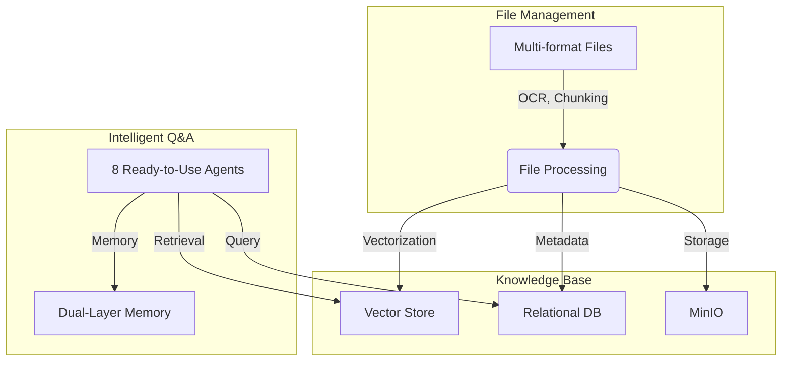

    

    

    Youtu-RAG: Next-Generation Agentic Intelligent Retrieval-Augmented Generation System
    

    

    
    

# Introduction

Youtu-RAG is a next-generation agentic retrieval-augmented generation system built on the **"Local Deployment · Autonomous Decision · Memory-Driven"** paradigm. With autonomous decision-making and memory learning capabilities, it represents best practices for personal local knowledge base management and Q&A systems.

The system's design focuses on upgrading traditional RAG from a passive retrieval tool to an **intelligent system with autonomous decision-making and memory learning capabilities**.

## Core Architecture

At a high level, Youtu-RAG's architecture consists of three main layers: the **File Management Layer** handles multi-source heterogeneous data ingestion, the **Knowledge Base Layer** performs vectorization and storage, and the **Agent Layer** provides intelligent retrieval and Q&A capabilities with dual-layer memory support.

## Key Modules

The system is divided into several key modules, each with a distinct responsibility.

### [Environment Variables (`environment_variables.md`)](./environment_variables.md)
The entire system is driven by environment variables for configuration. This includes LLM API keys, embedding services, database connections, MinIO object storage, and optional services like OCR and chunking.

### [WebUI Guide (`frontend.md`)](./frontend.md)
The core user interface for interacting with Youtu-RAG. The WebUI provides three main capabilities:
- **File Management**: Multi-format file upload, preview, batch operations, and metadata editing.
- **Knowledge Base Management**: Create knowledge bases, associate files/databases/examples, and build vector indices.
- **Intelligent Dialogue**: 8 ready-to-use agents for various Q&A scenarios with memory support.

### [Quickstart (`quickstart.md`)](./quickstart.md)
A step-by-step guide for installing dependencies, configuring environment variables, deploying necessary services (MinIO, Embedding, etc.), and starting the system.

## Core Features

### 📁 File-Centric Architecture
File-based knowledge organization supporting multi-source heterogeneous data including PDF, Excel, Images, and Databases.

### 🎯 Adaptive Retrieval Engine
Autonomously decides optimal retrieval strategies. Supports vector search, SQL query, and metadata filtering.

### 🧠 Dual-Layer Memory
Short-term conversational memory + long-term cross-session knowledge accumulation for Q&A experience learning.

### 🤖 8 Ready-to-Use Agents
From simple conversations to complex orchestration, covering various application scenarios including Web Search, KB Search, Meta Retrieval, Excel Research, and Text2SQL.

### 🎨 Lightweight WebUI
Pure native HTML + CSS + JavaScript implementation with zero framework dependencies. Supports file upload, knowledge base management, AI dialogue, and document preview.

### 🔐 Security & Control
All components support local deployment with data staying within domain. Integrated with MinIO object storage for large-scale file local management.

## Getting Started

For a step-by-step guide on how to install dependencies, set up your environment, and run the system, please see our [**Quickstart Guide**](./quickstart.md).

